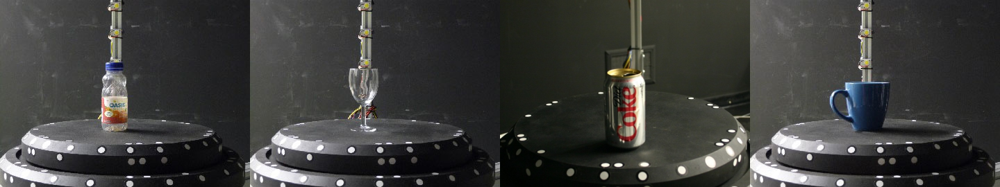
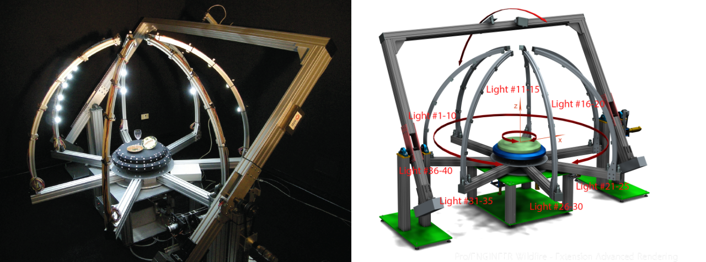

# Calibrated Multi-View Stereo and Multi-Light Source Dataset

+ Images of **4 objects with different geometry and reflective properties**.
+ Each object is captured under **30 different light sources** located on the hemisphere around an object.
+ **Extrinsic and intrinsic parameters** for each frame.
+ **722** images for each object in sparse set.
+ **11522** images for each object in full set.
+ **2448x2028**  resolution of each frame.

# Images and calibration parameters

<pre>
data
├── bottle
│   ├── images
│   |   ├── PoseCameras_XXX_YY_BW.png
│   |   ├── PoseCameras_XXX_YY_CL.png
│   |       ...
│   ├── params
│   |   ├── camera_bw_ext.txt
│   |   ├── camera_bw_int.txt
│        ....
├── cola
│   ...
├── cup
│   ...
├── glass
│   ...
</pre>
## Image filename structure
The first index XXX in image filename represents position of the turntable and ranges from 0 to 360 degrees, the second index YY is a light source number and it ranges from 11 to 40. The light source index number 00 represents a state when all the lights of the system are turned on. BW is camera #1 and CL is a camera #2. Sparse dataset contains only images with all lights turned on.

## Calibration parameters structure
+ camera_bw_int.txt - intrinsic parameters of the fist camera. 3x3
+ camera_cl_int.txt - intrinsic parameters of the second camera.3x3
+ camera_bw_ext.txt - extrinsic parameters of the fist camera. Each line describes the position of the camera in wrt turntable rotation. 360x4x4
+ camera_cl_ext.txt - extrinsic parameters parameters of the second camera. Each line describes the position of the camera wrt turntable rotation. 360x4x4
+ camera_cl_bw_transform.txt - camera BW and CL are rigidly fixed, therefore it is possible to go from reference to another using transformation matrix. 4x4

All the data are stored in row wise order.

# Full dataset links

+ [juice bottle](https://1drv.ms/u/s!Ams3viyFsmvDgQTB61f_-ATXjjJV?e=cSJGdH) ~1.56 GB
+ [vine glass](https://1drv.ms/u/s!Ams3viyFsmvDgQancHZrkvskR04o?e=3arQFj) ~1.77 GB
+ [cola cane](https://1drv.ms/u/s!Ams3viyFsmvDgQWxygzpbF0nKwz9?e=muNNv5) ~1.75 GB
+ [cup](https://1drv.ms/u/s!Ahibo8wnfqvFsH4pP1-neX8xcVNK?e=7e3iUY) ~1.68 GB

# Acquisition setup

These datasets were captured using system designed at University Laval at [Computer Vision and Systems Laboratory (CVSL)](http://vision.gel.ulaval.ca/en).
This setup allows the rotation of an object on a turntable, the control of the lighting conditions around an object and the selection of the camera viewpoint on a hemisphere.

## Setup characteristics:
+ A turntable: the diameter is equal to 450 mm, It can be rotated around the z axis by 360 degrees.
+ Light system, including 7 arms around the turntable, 6 of these 7 arms hold 5 directional
light sources, the other one holds 10. In total, there are 40 light sources which can be switched on and off independently.
The angle between neighboring arms is about 51.5 degrees.
+ The imaging system is equipped with two 5 megapixel "Point Grey" camera, one colour and one grayscale.  Cameras are mounted on a special arm, and each camera is pointing toward the center of the table, and can be moved around turntable.
+ The maximum acquisition volume is 300x300x300mm.

# Citation
    Shape from silhouette in space, time and light domains.
    M. Mikhnevich, D. Laurendeau
    International Joint Conference on Computer Vision, Imaging and Computer Graphics Theory and Applications (VISAPP), 2014